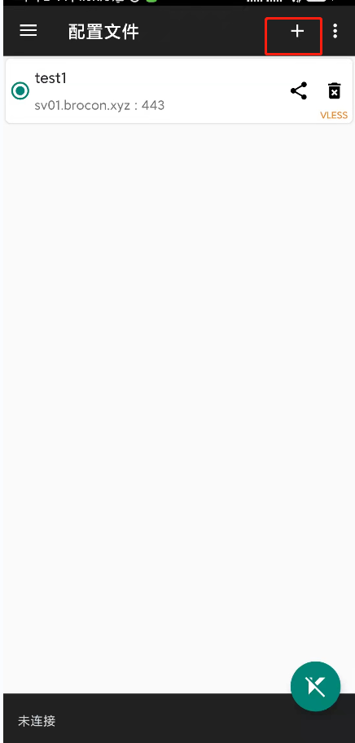
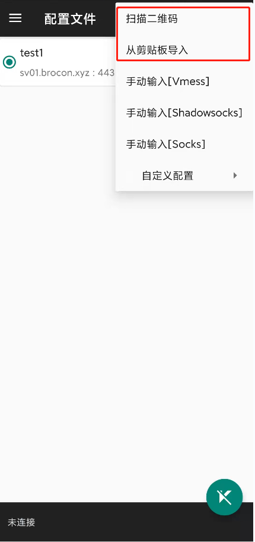
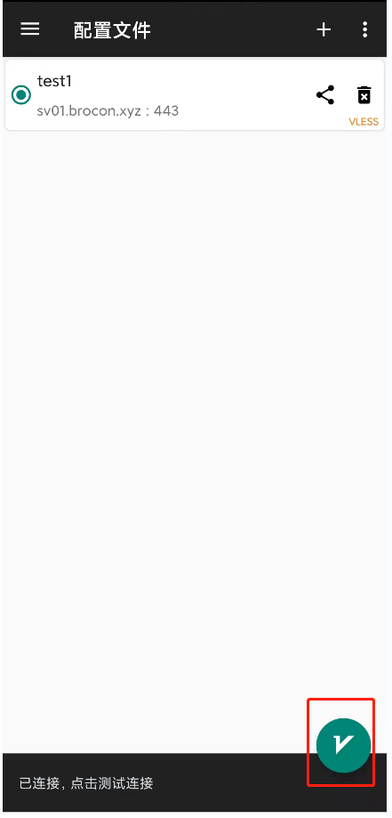

#Android 教程

##### 客户端下载
 - [客户端下载](https://github.com/brossr/BroXray/raw/master/files/obfs_client/android.apk)

##### 安装

- 进入 Bro网站并且登录，点击左上角菜单栏，选择『我的线路』。然后进入需要配置的服务，点击「下载二维码」 或者直接使用客户端扫描。

- 下载安装包以后安装APP，打开软件看到如下界面，点击右上角加号。

- 点击扫描二维码方式添加，或者直接粘贴复制的链接都可以

- 选中扫描的配置，点击左下角点击图标，即可使用

- 即刻开始畅享自由的互联网吧。