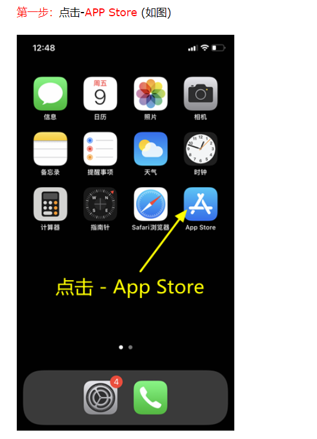

#IOS 教程

##### 客户端下载
 - [客户端下载教程](./美区ID教程.md)

##### 安装

- Shadowrocket 是一个付费工具，由于众所周知的原因已经在国内 App Store 下架，用户需要自行从美区 App Store 购买。

- 进入 Bro网站并且登录，点击左上角菜单栏，选择『我的线路』。然后进入需要配置的服务，点击「下载二维码」 或者直接使用客户端扫描。

- 打开 Shadowrocket，选中「首页」选项卡，点击右上角的「+」。

- 在「添加节点」中选择「Subscribe」类型。将上一步复制的链接填入下面「URL」文本框中，点击完成。

##### 使用
- 回到首页后会看到「服务器订阅」以及所有的节点。

- 选择需要使用的节点，点击第一排开关打开 Shadowrocket 即可使用,即刻开始畅享自由的互联网吧。