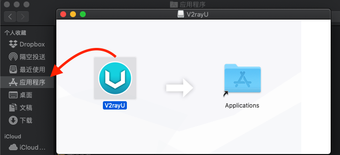
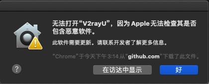
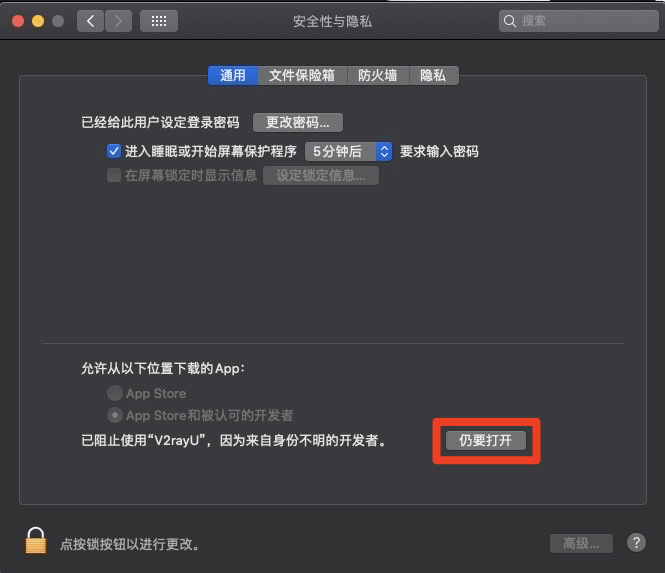
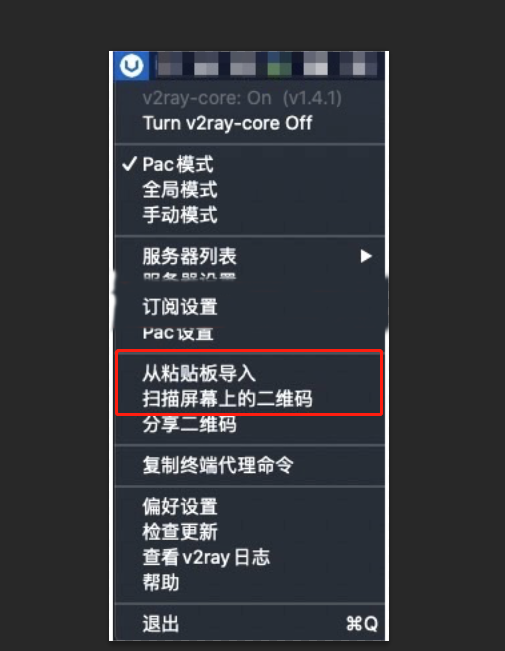

# mac 教程

##### 客户端下载
 - [Mac客户端下载](https://github.com/brossr/BroXray/raw/master/files/obfs_client/Mac.dmg)

##### 安装

下载后运行安装包，因为权限问题，需要手动将安装包拖入「应用程序」文件夹中。

安装后，点击运行，此时会弹出安全警告，需要在「系统偏好设置-安全性与隐私」中手动点击允许运行，并输入系统密码即可。

##### 配置
进入 Bro网站并且登录，点击左上角菜单栏，选择『我的线路』。然后进入需要配置的服务，点击复制链接，或者下载二维码。

右键点击出现在顶部栏中的「V2RayU」图标，在弹出菜单中选择「从粘贴板导入」 或 [扫描屏幕上的二维码]。

配置添加完毕后，你可以再次右键选择顶部栏中的「V2RayU」图标，选择不同的服务器节点和代理方式，即刻开始畅享自由的互联网吧。