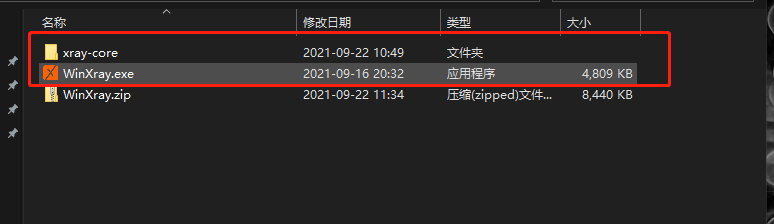
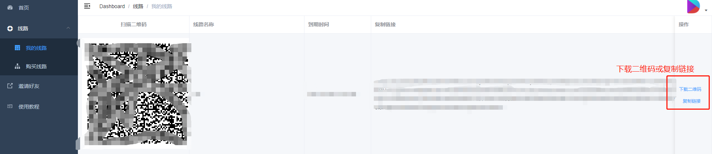
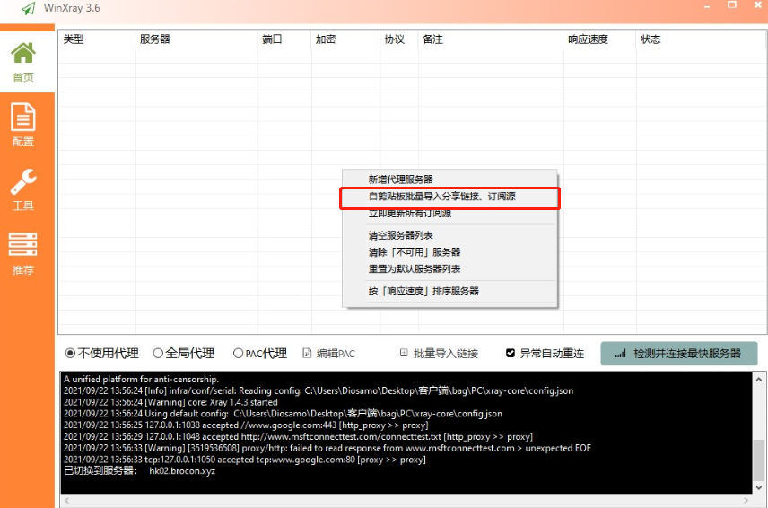
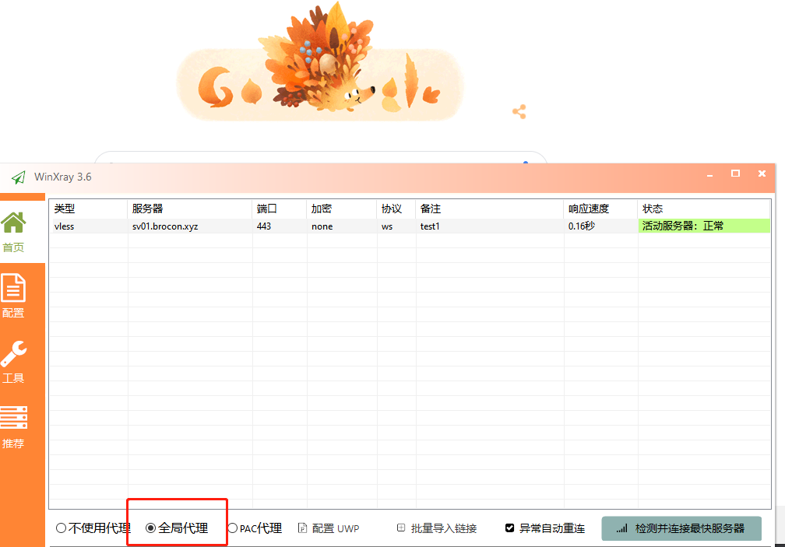

# Windows 教程

##### 客户端下载
 - [Windows客户端下载](https://github.com/brossr/BroXray/raw/master/files/obfs_client/WinXray.zip)

##### 安装

下载后，解压安装包得到如下文件

进入 Bro网站并且登录，点击左上角菜单栏，选择『我的线路』。然后进入需要配置的服务，点击「复制链接」。

打开WinXray.exe软件，导入刚刚复制的链接

导入成功会出现一条图中的数据，然后点击全局代理

即刻开始畅享自由的互联网吧。